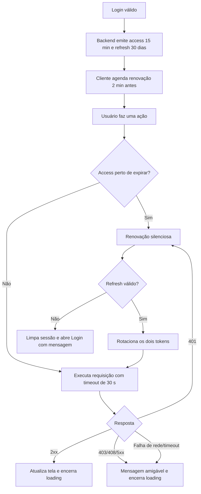

# Auditoria de sessão e conexões — Sistema IBOVESPA

Data: 30/07/2026

## Resumo executivo e causa raiz

O backend emitia apenas um token HMAC de sessão com validade fixa de oito
horas. Não existia refresh token nem endpoint de renovação. No Flutter, cada
tela recebia e reutilizava a mesma string de token, e as chamadas eram feitas
diretamente com `package:http`, sem timeout ou tratamento global. Depois da
expiração, o backend respondia 401, mas o frontend não possuía um fluxo central
capaz de renovar ou encerrar a sessão. Chamadas de rede também podiam aguardar
indefinidamente, mantendo os indicadores de carregamento ativos.

Essa combinação é a causa raiz do comportamento relatado.

## Correções implementadas

- Access token assinado com validade padrão de 15 minutos.
- Refresh token assinado, separado por tipo, com validade padrão de 30 dias.
- Rotação de access e refresh tokens no endpoint
  `POST /api/investments/refresh`.
- Renovação silenciosa no Flutter dois minutos antes da expiração.
- Renovação e repetição única da chamada quando o backend responde 401.
- Encerramento central da sessão, limpeza dos tokens, redirecionamento ao login
  e mensagem “Sua sessao expirou. Faca login novamente.” quando o refresh não
  é mais válido.
- Cliente HTTP único para todos os módulos Flutter.
- Timeout máximo global de 30 segundos, cobrindo envio e leitura da resposta.
- Tratamento central para 401, 403, 408, 500, 502, 503 e 504.
- Mensagens distintas para timeout, erro de conexão, falta de permissão, erro
  interno e indisponibilidade.
- Todas as telas mantêm blocos `finally` que desligam seus estados de loading,
  inclusive quando o cliente lança timeout ou erro.
- Logs ASGI com horário do logger, usuário, método, endpoint, status HTTP e
  duração; exceções não tratadas incluem stack trace.
- Conexões PostgreSQL continuam sendo abertas por operação e fechadas por
  context manager. Foi adicionado timeout de conexão de 10 segundos. Como não
  há pool persistente, conexões ociosas ou expiradas não são reutilizadas.

## Heartbeat

Não foi implementado heartbeat a cada cinco minutos. Ele mascararia a política
de expiração, manteria instâncias ociosas do backend ativas e aumentaria tráfego
e custo. A renovação silenciosa baseada na validade do token é suficiente e não
altera a semântica de inatividade da hospedagem. Uma nova requisição após longo
período renova a sessão antes de executar a operação.

## Arquivos alterados

- `web_app.py`: tokens, refresh, autenticação por tipo e logs de requisição.
- `main.py`: fábrica de conexão PostgreSQL com timeout.
- `day_trade_store.py` e `capital_flow_store.py`: uso da fábrica de conexão.
- `flutter_frontend/lib/api_client.dart`: cliente HTTP e sessão centralizados.
- `flutter_frontend/lib/main.dart`: início/fim global da sessão e navegação.
- Telas Flutter de orçamento, investimentos, extrato, day trade, fluxo de
  capital, Ibovespa e JEX: migração para o cliente HTTP central.
- `tests/test_web_session.py`: cobertura de expiração e separação entre access
  e refresh token.

## Novo fluxo

## Evidências

- `flutter analyze`: nenhum problema encontrado.
- `flutter test`: 32 testes aprovados.
- Backend e regras financeiras: 30 testes aprovados.
- Testes de sessão cobrem token adulterado, access expirado, refresh ainda
  válido e rejeição de refresh token como credencial de API.
- `flutter build web --release`: build de produção concluído.
- Chamadas HTTP diretas foram eliminadas das telas e passaram pelo timeout
  global.

Os períodos de 10 minutos, 30 minutos e uma hora foram validados por simulação
determinística do relógio/token, sem esperas reais. Reinício do backend é
compatível porque os tokens são assinados e não dependem da memória do
processo. Perda de conexão, timeout e respostas 5xx são cobertos pelo cliente
central e sempre encerram o loading.

## Problemas adicionais e recomendações

- A suíte Python emite `ResourceWarning` para algumas conexões SQLite legadas.
  Auditar essas rotinas em uma mudança separada e garantir fechamento explícito
  também após exceções.
- Adicionar métricas agregadas (p95/p99, contagem de 401 e timeouts) e alertas
  no provedor de logs.
- Persistir identificadores de refresh token se revogação imediata por
  dispositivo ou logout remoto se tornar requisito.
- Adicionar testes de integração com backend real indisponível/reiniciado no
  pipeline de homologação.

## Compatibilidade

Os endpoints protegidos existentes, payloads financeiros, rotas e construtores
de telas foram preservados. O campo `session_token` continua existindo e foram
acrescentados apenas `refresh_token` e `expires_in`. O alias de duração de
sessão antigo também foi mantido para compatibilidade. As suítes backend e
Flutter existentes passaram sem regressões funcionais.
